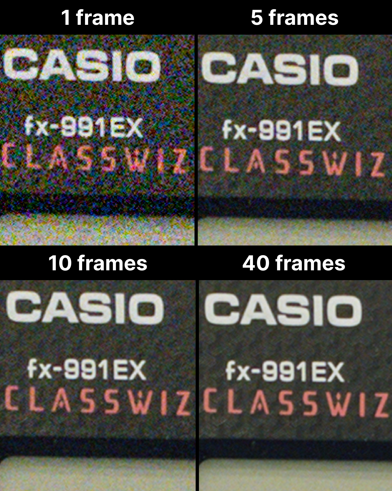

# Stack Camera
A native iOS camera app that uses burst photography to produce images with reduced noise and enhanced detail. Utilizing the Metal framework, the project implements a simplified version of the algorithm described in [Hasinoff et al. “Burst photography for high dynamic range and low-light imaging on mobile cameras”](https://research.google/pubs/pub45586/) (known publicly as Google HDR+).

## User Interface

## Examples
A single RAW image versus 5/10/40 merged frames:

  
   
  

The images were taken with an iPhone 12 mini's main (wide angle) camera.

## To-do list
- [ ] Add support for iOS 17 (can't save images to Photos there)
- [ ] Refactor massive `CameraViewController`
- [ ] Fix UI issues and ensure it is displayed correctly on all supported iPhones
- [ ] Improve permission handling
- [ ] Improve error handling
- [ ] Improve the image processing pipeline, possibly by adapting the [hdr-plus-swift](https://github.com/martin-marek/hdr-plus-swift) code

## Acknowledgements
- [hdr-plus-swift](https://github.com/martin-marek/hdr-plus-swift)
- [LibRaw](https://www.libraw.org)
- [libtiff-ios](https://github.com/ashtons/libtiff-ios)
